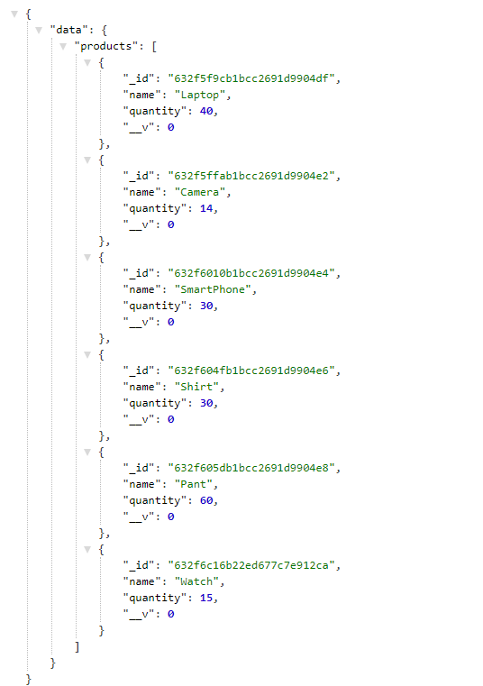

# ecommerce_api
- This is an ecommerce API for the platform admin to manage product inventory.
- This api is buit using Node.JS, EXPRESS.JS and MongoDB.

# Endpoints
- /products - to get all the products.
- /products/create - to create a product.
- /products/:id- to delete a product.
- /products/:id/update_quantity - to update the quantity of a product.

## Getting all the products
  ```
  const options = {method: 'GET'};

  fetch('https://ecommerce-api9.herokuapp.com/products', options)
  .then(response => response.json())
  .then(response => console.log(response))
  .catch(err => console.error(err));
  ```
## Creating a product
```
const options = {method: 'POST', body: '{"name":"Sports shoe","quantity":7}'};

fetch('https://ecommerce-api9.herokuapp.com/products/create', options)
  .then(response => response.json())
  .then(response => console.log(response))
  .catch(err => console.error(err));
```

## Updating a product's quantity
```
const options = {method: 'POST', body: 'false'};

fetch('https://ecommerce-api9.herokuapp.com/products/<product_id>/update_quantity?number=<amount_to_be_added>', options)
  .then(response => response.json())
  .then(response => console.log(response))
  .catch(err => console.error(err));
```

## Deleting a product
```
const options = {method: 'DELETE'};

fetch('https://ecommerce-api9.herokuapp.com/products/<product_id>', options)
  .then(response => response.json())
  .then(response => console.log(response))
  .catch(err => console.error(err));
```

# Live Demo
- https://ecommerce-api9.herokuapp.com/products

# How to run this project
- Nothing fancy, just clone it, then open the project on Visual Studio Code.
- Move to terminal, if it is not opened then open a new one.
- Now run the command `npm install` to install all the dependencies.
- Finally run the command `npm start`.
- Visit http://localhost:8000/products to see all the products.

# Screenshot
- /products get all products

  
